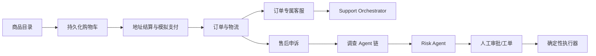

# 系统架构

```mermaid
flowchart LR
    C[顾客] --> STORE[React 商城/订单/售后]
    STAFF[全权限客服账号] --> DESK[React 客服后台]
    STORE --> A[FastAPI API]
    DESK --> A
    A --> AUTH[JWT + RBAC]
    A --> G[Support Orchestrator / LangGraph]
    G --> BA[四个业务 Agent]
    BA --> R[混合 RAG]
    BA --> T[只读业务工具]
    BA --> CW[申诉调查子流程]
    CW --> RA[Risk Agent]
    RA --> H[人工审批 / 工单]
    R --> EMB[BGE 中文 Embedding]
    R --> V[(PostgreSQL / pgvector)]
    G --> D[DeepSeek 流式生成]
    A --> DB[(业务数据库)]
    A --> RL[Redis 限流]
    A --> METRICS[/metrics 全链路指标]
    METRICS --> M[Prometheus + 告警规则]
    M --> GF[Grafana]
```

## 业务闭环



顾客角色只进入商城、订单、客服和申诉页面；唯一的全权限客服账号进入工作台、工单、申诉、质量看板和知识库，并完成申诉受理、调查与审批。商城订单号、会话记录、申诉号、工单号和 Agent 结构化结果在数据库中相互关联。

本地开发使用两个独立前端入口：员工后台运行在 `127.0.0.1:5173`，顾客商城运行在 `127.0.0.1:5175`。两者分别通过 Vite 的 `employee` 和 `mall` 模式构建为 `dist` 与 `dist-mall`，但共同访问同一个后端 API 和业务数据库。

商城咨询使用 `shop-general` 或 `shop-{order_id}` 作为会话 ID。用户消息和 Agent 结构化结果先持久化到 `conversations/messages`，员工后台再通过受 RBAC 保护的会话列表接口每 3 秒增量刷新商城队列。顾客无权枚举其他用户会话。

## 请求流程

1. JWT 确定真实用户，忽略客户端伪造的 `user_id`。
2. LangGraph 恢复 `user_id + session_id` 对应检查点。
3. Support Orchestrator 先执行高确定性规则；规则无法确认时调用 DeepSeek 输出受控结构，再由代码完成枚举、置信度、实体和风险校验。
4. 高置信度请求进入 Service、AfterSales、Appeal 或 Risk Agent；多意图冲突和普通低置信度请求先补问，高风险低置信度请求转人工，模型解析失败回退关键词路由。
5. 复杂申诉固定并行运行订单、政策、技术和财税四个只读调查节点。
6. Resolution Planner 汇总证据，Risk Agent 独立阻断高风险写操作。
7. DeepSeek 负责理解、总结和生成；订单归属、退款规则、审批和执行由确定性代码控制。
8. 审批前执行器返回空结果，高风险请求创建人工工单。
9. 会话、Agent 结构化结果、工单、审计和模型状态写入 PostgreSQL；LangGraph 状态由 `PostgresSaver` 写入同库的专用 checkpoint 表。
10. 知识类回答没有引用时，后台任务提取商品上下文并写入语义知识缺口簇；质量看板读取时补偿扫描未处理消息。

## 商城数据模型

`Product`、`CartItem`、`Address`、`CommerceOrder/OrderItem`、`Payment`、`Shipment` 和 `Appeal` 构成模拟交易域。支付接口不接触真实资金，但保留幂等订单状态、库存扣减、用户归属校验和后续接入支付网关所需的边界。商城订单同时映射到 Agent 只读订单工具，因此总 Agent 可以恢复订单上下文，而不能绕过审批直接退款。

## Agent 分层

| 层级 | 组件 | 职责 |
|---|---|---|
| 编排层 | Support Orchestrator | 唯一入口、意图路由、订单记忆、结果汇总 |
| 业务层 | Service / AfterSales / Appeal / Risk | Service 负责低风险查询，其余 Agent 分别负责售后执行、正式申诉和风险复核 |
| 调查层 | Order / Policy / Technical / Finance Investigator | 并行读取证据，禁止写操作 |
| 决策层 | Resolution Planner + Risk Agent | 形成方案并执行独立风险复核 |
| 执行层 | Human Gate + Deterministic Executor | 只有审批通过后才能提交业务写操作 |

所有子 Agent 使用统一 `AgentResult`，包含状态、发现、证据、工具、置信度、下一步、订单号和申诉号。工具白名单集中定义在 `agent/policies.py`，调查节点启动时会验证只读权限。

## 安全边界

- 关键业务规则不依赖 LLM 判断。
- 总 Agent 不直接调用高风险写工具，调查 Agent 只拥有 `.read` 工具。
- `Risk Agent` 的结论覆盖普通业务回答中的风险标记，避免汇总时丢失人工升级信号。
- 所有员工端接口统一使用唯一的 `admin` 全权限客服账号。
- 顾客只能读取自己的工单和业务数据。
- 上传文件限制类型、大小、文件名和文本编码。
- Bearer Token 避免 Cookie CSRF，响应增加安全头。
- 单机使用内存限流，配置 Redis 后自动使用共享限流。

## 数据选择

本地、Docker、CI 和生产统一使用 PostgreSQL 16 + pgvector。知识分段与知识缺口中心向量均写入 `vector(512)`，检索使用余弦距离 `<=>`。LangGraph `PostgresSaver` 复用同一数据库连接地址，但 checkpoint 表与业务表逻辑隔离。

知识缺口只在相同 `product_id` 分区内比较；无商品上下文的问题进入通用分区。相似度达到 `0.82` 时加入已有簇，否则创建新簇。同商品聚类写入使用 PostgreSQL advisory transaction lock，配合 `message_id` 唯一约束保证并发和补偿任务幂等。

## 可观测边界

HTTP 中间件使用 FastAPI 路由模板统计请求，避免动态 ID 造成标签基数膨胀；`/metrics` 与健康检查不计入业务请求。Support Orchestrator 在 LangGraph 总入口记录路由、结果、置信度、耗时和人工介入，DeepSeek、RAG 与确定性业务工具分别在真实 I/O 边界记录调用指标。

所有标签均为有限枚举，不包含用户、会话、订单、问题文本或模型输出。Prometheus 负责采集与规则评估，Grafana 通过 provisioning 自动加载只读数据源和总览 Dashboard；外部告警通知不属于当前项目范围。
